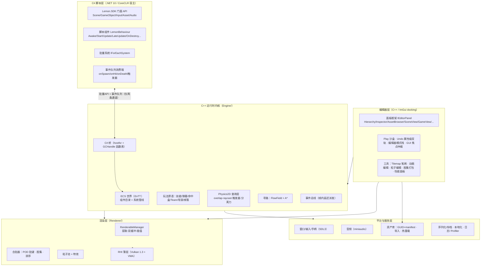
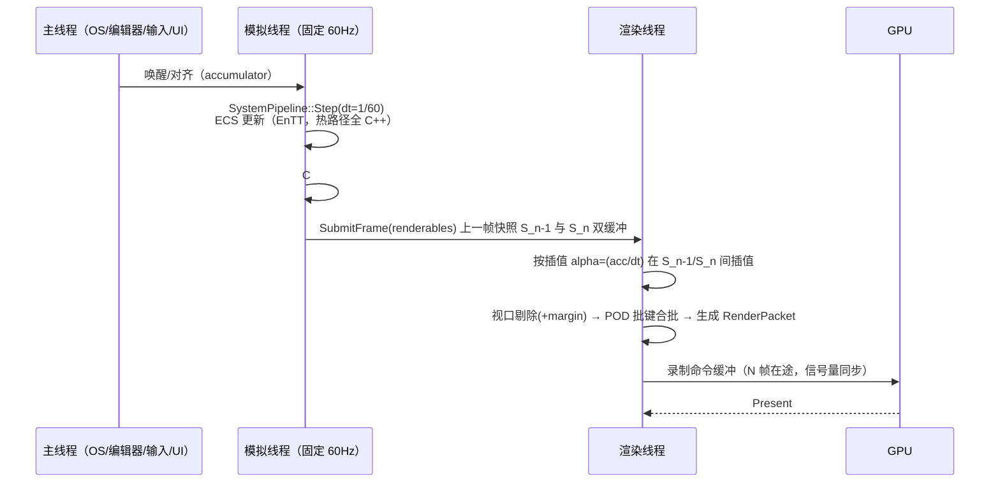

# Lemon 引擎设计 — 01 架构总览

> 本文定义引擎的分层结构、帧循环、线程模型、技术选型、目录纪律与构建系统。所有分册文档（02–06）的模块设计都必须落在本文的骨架之内；与骨架冲突时先改本文。

---

## 1. 分层架构



分层铁律：

1. **依赖只能向下**。编辑器依赖内核，内核绝不依赖编辑器；C# 与 C++ 只通过"桥"模块交互。
2. **Vulkan 零泄漏**（借 MoteurJV 门面纪律）：Vulkan/VMA 类型只允许出现在 `Renderer/RHI/*.cpp` 与 `Renderer/*.cpp` 的实现文件中；一切头文件只暴露自有句柄类型（`HwTexture`、`HwBuffer`、`ShaderHandle`…）。将来若加 Metal 后端，上层一行不改。
3. **C# ↔ C++ 边界通道族**（2026-10-02 修订注记，review #42：原文「只有两条通道」
   为 M3 时点口径，随 M5/M6 演进实际长成通道族——批量 API vtable（46 槽，尾加纪律）、
   结构命令缓冲、UI ops/事件对、生命周期钩子表，明细见 §8 与 04 §4）。不变式仍成立：
   **禁止逐实体逐帧跨语言调用**（批量进出 + 帧级队列的初衷不变，详见 04 文档 §4）。
4. **单一数据事实源**：场景/资产格式只有一份 schema，编辑器、运行时、C# SDK 读同一格式。渲染不做"编辑器预览版实现"（杜绝 yami 双实现漂移）。

## 2. 帧循环：固定步长模拟 + 双缓冲插值渲染

移植 Luma `Application/RenderableManager.h` 的核心思想（93 行头文件，性价比最高的单件移植）。



关键决策与理由：

| 决策 | 内容 | 理由 / 来源 |
|---|---|---|
| 固定步长 60Hz 模拟 | `accumulator` 模式；一帧最多执行 3 个逻辑步，超出则"追帧弃帧"并告警 | 割草游戏命中判定/弹幕必须确定性；也便于回放与压测复现 |
| 双缓冲帧数据 | `std::array<FrameArena<RenderableTransform>, 2>` 预分配（初始容量 10 万，可增长）+ `packetBuffers` 双缓冲 + `activeBufferIndex` 原子切换 | 移植 Luma RenderableManager；渲染线程永不触碰模拟线程正在写的数据 |
| 插值 alpha 缓存 | `frameVersion` 原子版本 + `m_lastBuiltAlpha` 比较，alpha 未变（帧率=模拟率）时跳过 packet 重建 | Luma 同款细节优化，144Hz 屏上省一半重建 |
| 渲染在途帧数 | 2 帧在途（triple buffer 语义），低余量时自动降到 1 | 输入延迟与吞吐的平衡点，M0 spike 实测后定死 |
| 时间缩放 | `Time.timeScale`（导演慢动作/暂停）作用于模拟步进，不影响渲染插值 | VS 类"升级选卡暂停"刚需。**M5 批① 已落地**：`World::Step` 内缩放 dt（clamp [0,8]，=0 冻结但 tick 照推），C# `Time.Scale` 经 native 表读写 |

## 3. 线程模型与系统调度

### 3.1 线程清单

| 线程 | 职责 | 说明 |
|---|---|---|
| 主线程 | 窗口事件、输入采样、编辑器 UI（ImGui）、C# 脚本非热路径回调调度、音频混音回调托管 | 输入采样后投递给模拟线程（拷贝成输入快照） |
| 模拟线程 | 固定步长 ECS 步进、物理查询层、寻路、C# 批量系统与事件派发 | 单线程为基线；JobSystem 只用于内部并行（见下） |
| 渲染线程 | 插值、剔除、合批、命令录制、提交 | 独立于模拟节奏，按显示节奏跑 |
| 工作窃取池 | `N = hw_concurrency - 2` 个 worker | 移植 Luma `Event/JobSystem.h`（**改动：`Schedule` 改值语义 `std::packaged_task` 移动入队，消除调用方生命周期陷阱**） |

**ECS 并发原则**（EnTT 现实约束下的务实解）：

- 系统管线整体按依赖顺序单线程执行（Essential → Simulation → Main 提取），**只有内部循环可并行**：`ParallelFor(range, grain)` 拆给 JobSystem，粒度 ≥ 256 实体（如分离力计算、空间哈希重建、弹幕越界回收、粒子模拟）。
- 明确两套"原生并行系统"模式：①无依赖的逐实体纯函数（粒子、回收）；②分块读写分离（空间哈希重建 = 每 cell 独立）。凡不满足两者之一的系统一律单线程。
- 物理查询层不需要 Box2D 式 ParallelFor（我们无求解器）；Luma `Systems/TaskSystem.h` 的适配层**不移植**，等真需要再写。

### 3.2 系统三类调度（移植 Luma SystemsManager 思路）

```cpp
enum class SystemStage : uint8_t {
    Essential,      // 场景生命周期：加载/卸载/实体销毁提交/组件注册表同步
    FixedTick,      // 60Hz 模拟步：输入→AI/行为→寻路→运动→命中→触发器→导演→脚本批量→事件派发
    Extract         // 每渲染帧：渲染数据提取（Transform/Sprite/粒子/文本）→ SubmitFrame
};
struct ISystem { virtual void OnStage(SystemStage, World&, float dt) = 0; };
```

系统间依赖用**声明式排序标签**（`after("Movement")`）而非硬编码下标，编辑器性能面板按实际执行序列可视化。

## 4. 技术选型清单（含论证与替代项）

| 领域 | 选型 | 版本锚点 | 论证 | 主要替代项（为何不选） |
|---|---|---|---|---|
| 内核语言 | C++20 | MSVC 19.38+ / clang 16+ | 性能、生态（Vulkan/EnTT/VMA 一线支持）；C++23 编译器矩阵不齐（Editor-RPG2D 用 23 但未用到独有特性） | Rust（单人团队 + C# 互操作成本高） |
| 图形 API | **Vulkan 1.3** + MoltenVK(macOS 开发期) | VMA 3.x | 用户明确要求；Windows 原生驱动质量最好；绕开本机验证过的 legacy GL 驱动坑 | Dawn/WebGPU（Luma 路线，好但不是我们要的"直写 Vulkan"）；OpenGL（否决） |
| 窗口/输入 | **SDL3** | CPM 锁 commit | 窗口+键盘鼠标+手柄+触摸一体，Vulkan surface 官方路径，Luma 同款 | glfw（Looper 用，无手柄/音频，还得拼） |
| ECS | **EnTT** | CPM 锁 commit | 事实标准；sparse-set 视图性能足够；C# 侧不需要它的复杂性 | 自研（MoteurJV Registry 是教学级，多组件 O(n·m) 不可用）；flecs（C 风格 API，meta 体系与 C# 桥接更绕） |
| 编辑器 UI | **ImGui（docking 分支）** | CPM 锁 commit | Luma/MoteurJV/Looper 三家实证；保留模式成本单人不可承受 | Qt（体量/许可/QML 团队性）；自绘 GUI（Editor-RPG2D 证明了 2.7 万行只能换来 30 控件） |
| C# 运行时 | **CoreCLR 宿主（hostfxr）** | .NET 10 | Luma CoreCLRHost 全套可移植（MIT）；断点调试、AssemblyLoadContext 热重载是原生能力 | Mono（旧路径，Luma 已弃）；NativeAOT（无运行时卸载/热重载） |
| 内存分配 | VMA + 自研 `FrameArena`/`Pool<T>` | — | VMA 是 Vulkan 事实标准；帧分配器移植 Luma | — |
| 音频 | **miniaudio** | 锁 release | 单头文件、解码/混音/3D 不需要（2D）、无依赖 | SDL_audio（能力重叠，抽象层薄）；FMOD/Wwise（商业许可） |
| 数学 | **glm** | CPM 锁 commit | Luma 同款；Vulkan/GLSL 对齐 | 自研（没必要） |
| 序列化 | nlohmann/json + 自研 codec | CPM/vcpkg | JSON 可 diff（原则 6）；大数组行程编码（移植 yami codec 思想） | protobuf/flatbuffers（二进制不可读，编辑器 diff 需求被破坏） |
| 物理 | **自研查询层**（无第三方） | — | 品类不需要求解器（原则 5）；继承 Prowl2D roadmap 同款结论 | Box2D（无用武之地，徒增体积） |
| 着色器语言 | **GLSL 450 → glslang → SPIR-V** | glslang CPM 锁 | Vulkan 标准 toolchain；Luma 的 WGSL 可直译 | Slang/HLSL（多一层映射，暂不引入） |
| 构建 | **CMake ≥ 3.24 + CPM.cmake（锁 commit）+ vcpkg（二进制包）** | — | 照搬 Luma `External/CMakeLists.txt` 的混合模式：源码依赖锁 commit、二进制依赖走 vcpkg | xmake/premake（单人无收益） |
| 单元测试 | Catch2 / doctest | CPM | Catch2 与 CMake ctest 集成好 | — |
| 性能剖析 | Tracy Profiler | CPM | 跨 C++/C# 标记、帧时间线、锁分析，开源标准 | optick（停止维护） |
| Steam | steamworks SDK | 官方 | M7 才接入，经薄封装动态加载 | — |

> 依赖治理规则：新增第三方库必须在 07 文档追加行（用途/许可/版本/锁定方式），并在 PR 描述回答"为什么不由引擎自研或裁剪"。**红线：不引入 DI 容器/服务注册器**（继承 Prowl 规划的架构原则；显式 Context 传参）。

## 5. 引擎目录结构（仓库级纪律）

> **2026-10-02 修订（review #101）**：下树为 M0 设计基准。实际演进差异（以仓库为准）：
> `Math/` 并入 `Core/Math.h`（仅 2D 数学单头足够）；`Input/` 并入 `ECS/Input.h`
>（输入快照直挂 World）；`Navigation/`、`Engine/Assets/` 尚未建立（M6d / M7a 批②）；
> `Renderer/` 无 `RHI/`、`Batch/`、`Particles/`、`Text/`、`Passes/` 子目录（RHI/
> Batch/Particles/BitmapFont 皆平铺单文件，Shaders/ 在位）；新增 `Platform/`（窗口/
> SDL 装配）、`Ui/`（RmlUi 集成，ADR-014）、`Scripting/dotnet/{Lemon.Entry,Lemon.SDK}`
>（原规划的顶层 `CSharp/` 收进 Scripting）；`External/` 由 `~/.cache/Lemon-CPM` +
> `Engine/Scripting/host`（vendored 头）承担；`Tools/` 现为 `tools/`。M7a 批⑧ 收官时
> 按实况重绘本树并删除本注记。

```
Lemon/
├── Engine/                     # C++ 运行时内核（随游戏发布，静态或动态库）
│   ├── Core/                   # 平台抽象、日志、断言、Time、FrameArena、Pool、JobSystem、Event
│   ├── Math/                   # 仅 2D：Vec2/Rect/Mat3(2D仿射)/颜色/随机流(seeded, 确定性)
│   ├── ECS/                    # World、系统管线、组件注册表（对 EnTT 的薄封装）
│   ├── Components/             # 组件目录（Transform2D/Sprite/...，纯数据，见 03 文档）
│   ├── Systems/                # 系统实现（Movement/Hits/Spawner/Director/...）
│   ├── Physics2D/              # 查询层：空间哈希、overlap/raycast、触发器、分离力
│   ├── Navigation/             # FlowField、A*、导航网格构建
│   ├── Renderer/               # 渲染层（Vulkan 类型只允许出现在 .cpp）
│   │   ├── RHI/                # Vulkan+VMA 封装：Device/Swapchain/Pipeline/Buffer/Texture/ShaderCache
│   │   ├── Batch/              # RenderableManager、批键、图集运行时、排序
│   │   ├── Particles/          # 粒子池/发射器/渲染
│   │   ├── Text/               # 位图字体(v1)、SDF(v2)
│   │   └── Passes/             # 后处理、(M8)光照
│   ├── Scripting/              # CoreCLRHost、C# 桥、事件队列、绑定辅助（见 04）
│   ├── Assets/                 # 资产库：GUID/manifest、导入器运行时侧、热重载
│   ├── Audio/                  # miniaudio 封装：总线、音量池、2D 混音
│   ├── Input/                  # 输入快照、虚拟轴、手柄映射（yami input.ts 思想）
│   └── Serialization/          # JSON schema 读写、场景 codec（RLE）、存档通道
├── Editor/                     # C++ ImGui 编辑器（仅开发机存在，不随游戏发布）
│   ├── App/                    # EditorEntry、主循环、布局持久化
│   ├── Panels/                 # IEditorPanel 实现（见 05）
│   ├── Interaction/            # 模式栈、焦点仲裁、放置状态机、Gizmo（见 05）
│   └── Tooling/                # Tilemap 笔刷、动画/粒子编辑、图集打包器、性能面板
├── CSharp/                     # C# 侧
│   ├── Lemon.SDK/            # 门面 API + 绑定（随脚本程序集引用）
│   ├── Lemon.ScriptLib/      # 引擎内置 C# 库（行为脚本、UI 钩子，源码随项目可见可改）
│   └── Generator/              # （后期）绑定生成器 / Inspector 元数据源生成
├── Templates/                  # 模板项目：vs-survivor/、tower-defense/、incremental/、blank/
├── Tools/                      # CLI：打包器、图集离线打包、资产校验、导表
├── Samples/                    # 压测场景（bench-mow、bench-defense）与特性示例
├── External/                   # CPM/vcpkg 依赖（Luma 模式）
├── docs/                       # 本套设计文档 + 后续 ADR（架构决策记录）
├── CMakeLists.txt
├── CMakePresets.json           # win-release / mac-dev(MoltenVK) / asan / bench
└── CMakeUserPresets.json       # 本机覆盖（gitignore）
```

纪律：`Engine/` 头文件不得 `#include` 任何 Vulkan/SDL/EnTT 头（Pimpl + 前置声明 + 自有句柄）；`Editor/` 不得被 `Engine/` 引用；`CSharp/` 不含引擎机密，SDK 源码对用户可见（学习与调试友好）。

## 6. 内存与数据布局总方针

- **帧分配器**：`FrameArena<T>` 双缓冲（渲染提取用，容量 10 万 transform 起步）；模拟侧事件队列用环形缓冲 + 帧末清空。
- **池**：怪物/投射物/粒子/飘血数字/掉落物**只从池取用，死亡归还，永不 new/delete**（yami 性能四件套第一条，作为引擎内建而非用户纪律）。EnTT 实体本身天然回收，池管的是"重负载组件包"（动画状态、渲染代理、脚本盒）。
- **SoA 优先**：热路径组件（Position/Velocity）依赖 EnTT 内部布局；粒子是显式平行数组（CPU AoS alignas(16) + GPU 4×vec4，见 02 §6）。
- **对齐纪律**：所有 GPU 常量结构 `alignas(16)`（Luma 纪律照抄）；SIMD 路径仅限空间哈希与分离力（M1 后按 profiler 数据再上，不预设）。

## 7. 错误处理、日志与配置

- **错误分级**（2026-10-02 收敛修订，review 2026-10-02 #20）：`LEMON_ASSERT`（引擎内部不变量）/ `LEMON_CHECK`（外部输入校验）**两者同为恒生效致命断言，release 不编译掉**——引擎纪律 = 错误一律响亮暴露（CI/验证层可捕获）；早期文本此处写「ASSERT 开发期断言、release 编译掉」从未实现，且部分防线（如图集槽冲突登记）在 release 只有断言一道，编译掉即裸奔，故按实现收敛。`Result<T>`（资产加载等可恢复路径，禁止异常跨越 C 边界）。C++ 侧不开 RTTI 异常跨模块；C# 侧异常在桥边界被捕获并转为脚本错误报告（红字进 Console 面板 + 暂停该脚本组件），**绝不崩溃引擎**。
- **日志**：分级（Trace/Info/Warn/Error）+ 环形缓冲进编辑器 Console + 异步落盘 `logs/`。
- **配置**：引擎/项目配置均为 JSON（schema 版本化）；图形质量分级 Low/Medium/High（粒子预算、特效开关联动，借鉴 Luma QualityManager 思路），运行时可切。

## 8. C++/C# 边界总览（细节在 04 文档）

命名（ADR-009）：C# 门面以 **GameObject** 为正名（Unity 命名级对齐），底层即同一 EntityHandle；档②③批量/性能层保留 Entity 措辞。

| 通道 | 方向 | 频率 | 载荷形态 |
|---|---|---|---|
| 批量读 API | C# → C++ | 每帧若干次 | blittable struct 数组段（`Span<T>` ↔ 指针+长度），如 `GetPositions(NativeSlice<Position>)` |
| 批量写 API | C# → C++ | 每帧若干次 | 同上，写回命令缓冲在帧末一次性应用 |
| 事件队列 | C++ → C# | 每逻辑帧 1 次派发 | `NativeQueue<ScriptEvent>`（spawn/hit/death/trigger/timer），C# 端一次 P/Invoke 取走整段 |
| 脚本组件生命周期 | C++ 调 C# | 低频 | GCHandle 函数指针表（Create/Start/Update/SetProperty/InvokeMethod/Destroy），Luma CoreCLRHost 模式 |
| 资产/场景 API | C# → C++ | 低频 | 句柄 + GUID，同进程直读资产库缓存 |

## 9. 构建与平台矩阵

| 目标 | 工具链 | 说明 |
|---|---|---|
| Windows 编辑器/游戏 | MSVC 19.38+ / Vulkan SDK | 首发平台；CI 产物 |
| macOS 编辑器/游戏（开发期） | clang 16+ / MoltenVK | 只保证"能开发调试"；正式支持第二批 |
| Linux | 暂缓 | 第三批；SDL3/Vulkan 路径已天然兼容，无计划性工作 |
| 发布物 | `Tools/packager`：游戏数据包 + 引擎动态库 + 自解压安装器（NSIS/MSIX 二选一，M7 定） | 见 06 §8 |

CI 门槛（从 M1 起生效）：Win+mac 全量编译绿 → 单测绿 → bench-mow 冒烟（10 万精灵旋转场景 ≥ 60fps，数字进提交信息）→ 才可合入主线。

## 10. 本文档级别的 ADR 索引（后续以独立 ADR 文件细化）

| ADR | 决策 | 状态 |
|---|---|---|
| ADR-001 | 固定步长 60Hz 模拟 + 双缓冲插值渲染 | 已采纳（本文 §2） |
| ADR-002 | Vulkan 直写 + 薄 RHI（非 Dawn/WebGPU） | 已采纳（本文 §4） |
| ADR-003 | EnTT 作为唯一实体模型；C# 侧门面不重复造 ECS | 已采纳 |
| ADR-004 | C++/C# 边界仅"批量 API + 事件队列"双通道 | 已采纳（本文 §8） |
| ADR-005 | 编辑器 ImGui docking + 与运行时同源双入口 | 已采纳 |
| ADR-006 | 无第三方物理库，自研查询层 | 已采纳 |
| ADR-007 | JSON+schema+RLE 作为唯一数据格式 | 已采纳（06 细化） |
| ADR-008 | 运行时 UI：v1 ImGui HUD；v1.x 富 UI 首选 RmlUi（spike 已验收，自研 RenderInterface 接引擎 RHI） | 已采纳（`docs/ADR/ADR-008-Runtime-UI-Strategy.md`，06 §8） |
| ADR-009 | Prowl2D 升格为理念/API 蓝本；C# 门面 Unity 命名级对齐（GameObject 正名 / LemonBehaviour / 双路由 AddComponent） | 已采纳（`docs/ADR/ADR-009-Prowl2D-Blueprint-and-Unity-API-Alignment.md`） |
